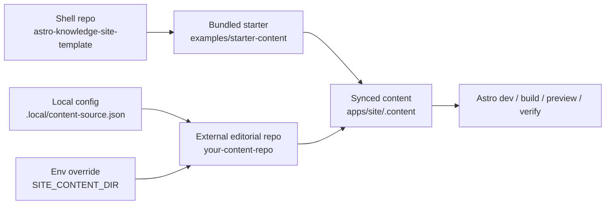

# Astro Knowledge Site Template

Astro template for structured knowledge sites with external content, localized routes, reusable section renderers, and a bundled starter content root.

[](https://github.com/frontandrews/astro-knowledge-site-template/actions/workflows/verify.yml)


This repository is for people who want to publish more than a blog.

Use it when you want:

- articles with structure, not only chronological posts
- tracks, concepts, glossary entries, and practice content in the same shell
- a clean split between the app shell and the editorial repository
- a project that still runs on a clean clone without extra setup

The code-level branding stays generic on purpose. The public positioning of this repo is specific.

## Screenshots

The screenshots below come from [seniorpath.pro](https://seniorpath.pro), the advanced live example built on top of this shell.

<p>
  
  
</p>
<p>
  
  
</p>
<p>
  
</p>

## Why this template exists

- **Shell separate from content.** Layouts, routes, reusable UI, search, and rendering logic live here. The published editorial content can live elsewhere.
- **Manifest as contract.** `collections.manifest.json` is the interface between the shell and the content source.
- **Starter local, content external later.** A clean clone works with `examples/starter-content`, then can graduate to a dedicated content repo without changing the shell model.

## Good Fit / Bad Fit

| Good fit | Not a fit |
| --- | --- |
| knowledge sites with articles, tracks, concepts, glossary, and practice | personal landing pages with little or no content structure |
| teams that want shell and content separated | CMS-first projects that expect live in-browser editing |
| projects that need localized routes and section labels | projects that only need one flat blog index |
| static publishing flows with clear build-time content inputs | highly dynamic apps that depend on runtime content storage |

## Clone And Run

Use this when you want the fastest path to a working local copy.

```bash
pnpm install
pnpm dev
```

That already works because the shell falls back to `examples/starter-content`.

If you also want ignored local files created for you:

```bash
pnpm init:template
```

That command creates local files only when they do not exist yet:

- `.local/content-source.json`
- `apps/site/.env`

## Use With An External Content Repo

Use this when the app shell and the editorial content should evolve independently.

### Option A: local config file

Create `.local/content-source.json`:

```json
{
  "contentRoot": "../your-content-repo"
}
```

### Option B: environment variable

```bash
SITE_CONTENT_DIR=/absolute/path/to/your-content-repo pnpm dev
```

The resolution order is:

1. `SITE_CONTENT_DIR`
2. `.local/content-source.json`
3. `examples/starter-content`

More detail: [docs/external-content.md](./docs/external-content.md)

## Rebrand For Your Own Site

Use this when the shell is right but the identity is not yours yet.

1. Update `apps/site/src/brand/brand.config.ts`
2. Set your public env vars in `apps/site/.env`
3. Rename section labels and route segments in `collections.manifest.json`
4. Replace the starter content or point to your real content repo
5. Run `pnpm verify`

More detail: [docs/rebrand.md](./docs/rebrand.md)

## First Successful Customization

Your first real customization is done when all of these are true:

- [ ] `PUBLIC_SITE_NAME` matches your product
- [ ] `PUBLIC_SITE_URL` matches your domain
- [ ] `PUBLIC_STORAGE_NAMESPACE` matches your project
- [ ] `collections.manifest.json` uses your section labels and route slugs
- [ ] the shell runs against your own content root
- [ ] `pnpm verify` passes after the rebrand

## Advanced Live Example

The public shell example is [seniorpath.pro](https://seniorpath.pro). Treat it as an advanced implementation of this template, not as the default branding.

- Article: [Writing Code People Can Understand](https://seniorpath.pro/articles/thinking-like-a-senior/writing-code-people-can-read/)
- Track: [How to think before you solve](https://seniorpath.pro/tracks/how-to-think-before-you-solve/)
- Concept: [Idempotency](https://seniorpath.pro/concepts/idempotency/)
- Glossary: [Two pointers](https://seniorpath.pro/glossary/two-pointers/)
- Challenge: [Two Sum without memorizing the trick](https://seniorpath.pro/challenges/two-sum/)

## Public Environment Variables

These are the currently supported public env vars. No new env vars are needed for the adoption phase.

| Variable | Required | When used | Notes |
| --- | --- | --- | --- |
| `PUBLIC_SITE_NAME` | optional | always | visible site name override |
| `PUBLIC_SITE_DESCRIPTION` | optional | always | meta description override |
| `PUBLIC_SITE_URL` | recommended in production | always | used for canonical URLs, sitemap, and feed metadata |
| `PUBLIC_STORAGE_NAMESPACE` | optional | always | browser storage namespace |
| `PUBLIC_APP_URL` | optional | only if you link to a separate practice app | defaults to `/app` when unset |
| `PUBLIC_LEGAL_OWNER_NAME` | optional | only if you publish legal pages with real operator info | falls back to template copy |
| `PUBLIC_LEGAL_OWNER_LOCATION` | optional | same as above | falls back to template copy |
| `PUBLIC_GOVERNING_LAW` | optional | same as above | falls back to template copy |
| `PUBLIC_GOVERNING_VENUE` | optional | same as above | falls back to template copy |
| `PUBLIC_LEGAL_EMAIL` | optional | same as above | falls back to template copy |
| `PUBLIC_SUPPORT_EMAIL` | optional | same as above | falls back to template copy |
| `PUBLIC_NEWSLETTER_URL` | optional | only when newsletter is enabled in `brand.config.ts` | newsletter stays off by default |
| `PUBLIC_GISCUS_REPO` | only if comments are enabled | comments | comments stay off by default |
| `PUBLIC_GISCUS_REPO_ID` | only if comments are enabled | comments | required with Giscus |
| `PUBLIC_GISCUS_CATEGORY` | only if comments are enabled | comments | required with Giscus |
| `PUBLIC_GISCUS_CATEGORY_ID` | only if comments are enabled | comments | required with Giscus |
| `PUBLIC_GISCUS_THEME` | optional | comments | defaults to `app` |
| `PUBLIC_GISCUS_EMIT_METADATA` | optional | comments | defaults to `0` |
| `PUBLIC_GISCUS_INPUT_POSITION` | optional | comments | defaults to `bottom` |
| `PUBLIC_GISCUS_MAPPING` | optional | comments | defaults to `pathname` |
| `PUBLIC_GISCUS_REACTIONS_ENABLED` | optional | comments | defaults to `1` |
| `PUBLIC_GISCUS_STRICT` | optional | comments | defaults to `0` |

`newsletter` is intentionally offline until you enable the feature and set `PUBLIC_NEWSLETTER_URL`.

## Architecture



## Repository Layout

- `apps/site` — Astro app, routes, layouts, brand defaults, sync scripts
- `packages/content` — shared helpers used by the shell
- `examples/starter-content` — runnable starter content root
- `docs` — rebrand, deploy, content-repo, and FAQ guides
- `scripts/init-template.mjs` — non-destructive bootstrap for ignored local files

## Stability Policy

- The project is currently in `v0.x`
- `v0.x` means the repo is active, but some internal details can still move
- `collections.manifest.json` is the primary stable contract between shell and content
- Changes to the contract should be documented in `CHANGELOG.md`
- New optional capabilities should default to non-breaking behavior

## Docs

- [Rebrand the template](./docs/rebrand.md)
- [Use an external content repo](./docs/external-content.md)
- [Deploy the template](./docs/deploy.md)
- [FAQ](./docs/faq.md)
- [Contributing](./CONTRIBUTING.md)
- [Changelog](./CHANGELOG.md)

## Community

- Public roadmap: [issue #1](https://github.com/frontandrews/astro-knowledge-site-template/issues/1)
- Showcase / built with this template: [issue #2](https://github.com/frontandrews/astro-knowledge-site-template/issues/2)

## Validation

The core acceptance path for this repo is still:

```bash
pnpm init:template
pnpm verify
```

If those pass on a clean clone and with an external content root, the onboarding model is healthy.
