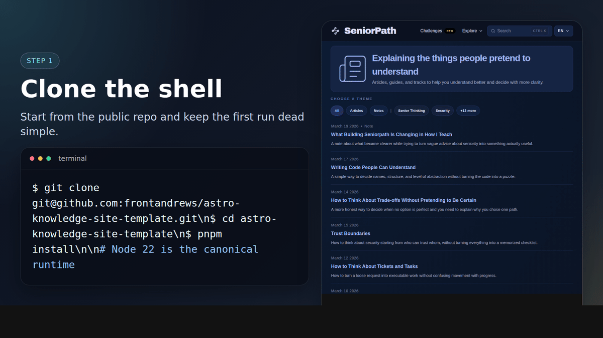
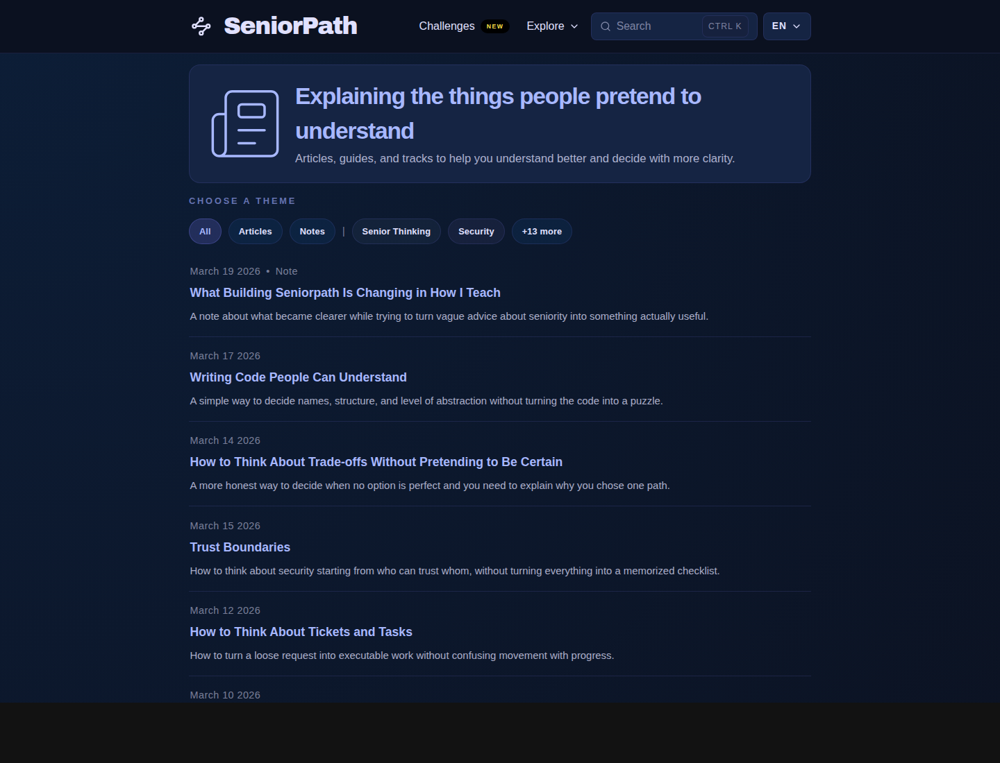
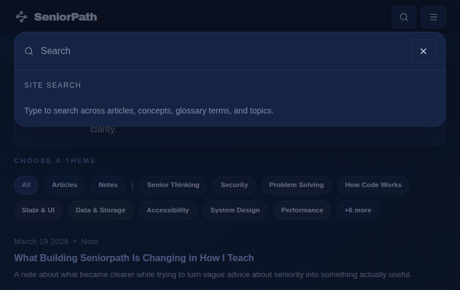
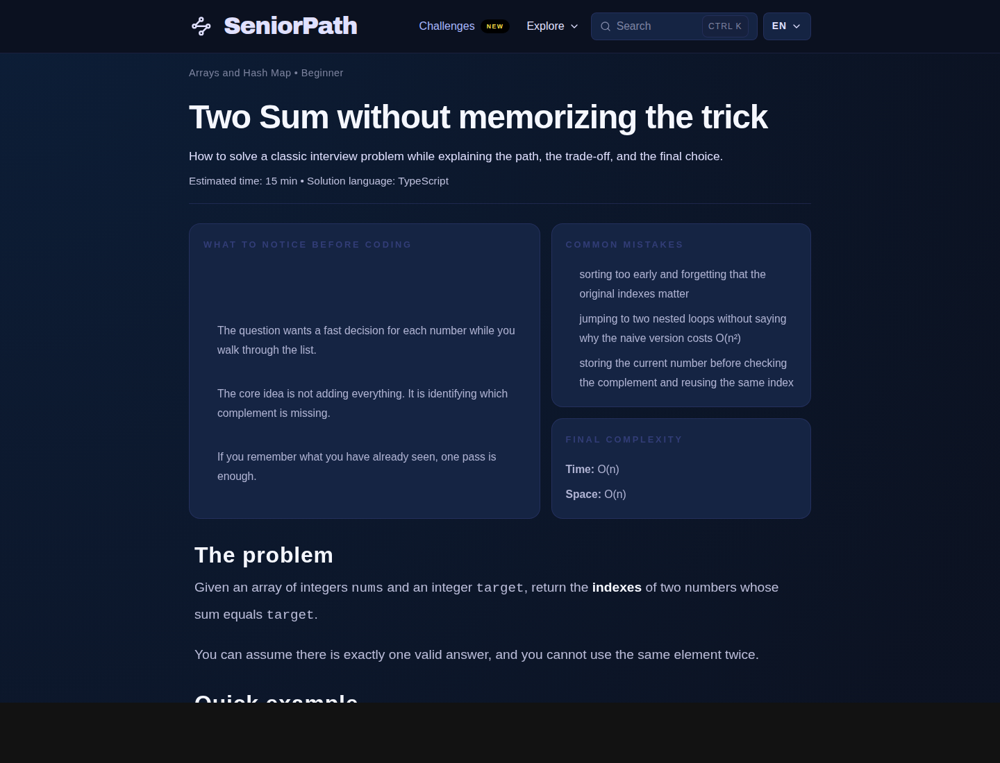
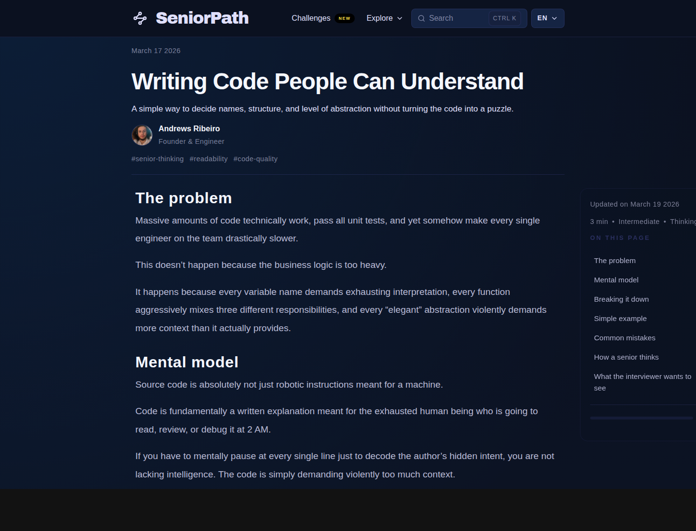
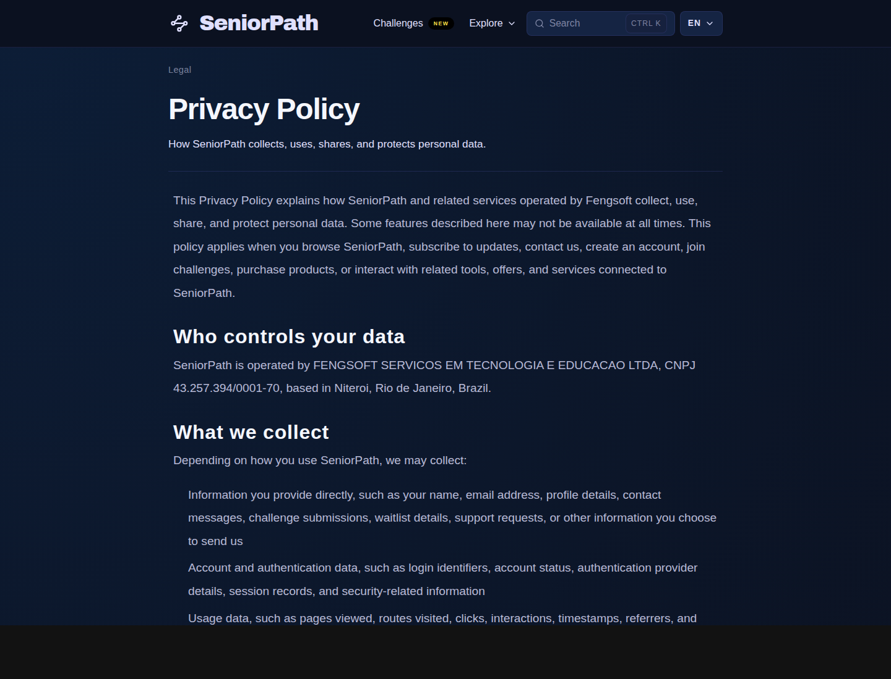
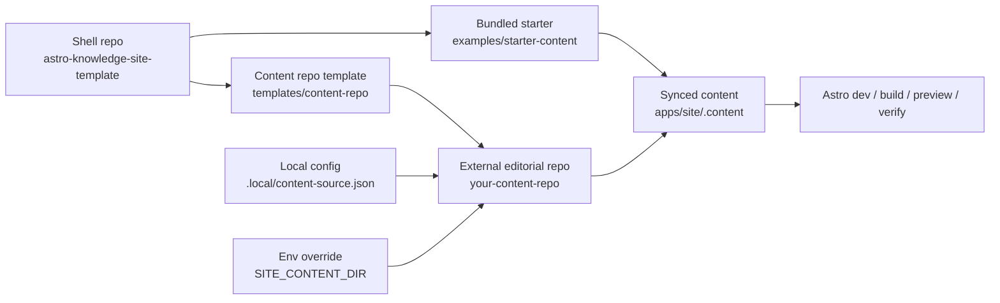

# Astro Knowledge Site Template

Astro template for structured knowledge sites with external content support, localized routes, reusable section renderers, and a bundled starter content root.

[](https://github.com/frontandrews/astro-knowledge-site-template/actions/workflows/verify.yml)


This repository is for people who want to publish more than a blog.

Use it when you want:

- articles with structure, not only chronological posts
- tracks, concepts, glossary entries, and practice content in the same shell
- a clean split between the app shell and the editorial repository
- a project that still runs on a clean clone without extra setup

The code-level branding stays generic on purpose. The public positioning of this repo is specific.

## Requirements

- Node `22`
- `pnpm@10.32.0`

Node `22` is the canonical runtime for local setup, CI, and deployment examples this quarter.

## Two-minute setup

The GIF below shows the official path:

1. clone the shell
2. run `pnpm init:template`
3. optionally scaffold a separate content repo
4. validate starter or external mode explicitly

<p>
  
</p>

## Screenshots

The screenshots below come from [seniorpath.pro](https://seniorpath.pro), the advanced live example built on top of this shell.

<p>
  
  
</p>
<p>
  
  
</p>
<p>
  
</p>

## Why this template exists

- **Shell separate from content.** Layouts, routes, reusable UI, search, and rendering logic live here. Published editorial content can live elsewhere.
- **Manifest as contract.** `collections.manifest.json` is the interface between the shell and the content source.
- **Starter local, content external later.** A clean clone works with `examples/starter-content`, then can graduate to a dedicated content repo without changing the shell model.

## Good Fit / Bad Fit

| Good fit | Not a fit |
| --- | --- |
| knowledge sites with articles, tracks, concepts, glossary, and practice | personal landing pages with little or no content structure |
| teams that want shell and content separated | CMS-first projects that expect live in-browser editing |
| projects that need localized routes and section labels | projects that only need one flat blog index |
| static publishing flows with clear build-time content inputs | highly dynamic apps that depend on runtime content storage |

## Official path

Use this sequence as the default adoption path for the repo.

### 1. Clone and bootstrap the shell

```bash
pnpm install
pnpm init:template
pnpm verify:starter
pnpm dev
```

`pnpm verify` still works and is currently an alias for `pnpm verify:starter`.

### 2. Optionally scaffold a separate content repo

```bash
pnpm init:content-repo ../my-content
pnpm init:template --content-root ../my-content
SITE_CONTENT_DIR=../my-content pnpm verify:external
```

That keeps the contract the same while moving editorial content into its own repository.

## Starter mode

Use starter mode when you want the fastest local boot or a public demo deployment with no extra repository.

The shell falls back to `examples/starter-content`.
`pnpm verify:starter` always pins that bundled content root, even if your local config points somewhere else.

```bash
pnpm init:template
pnpm verify:starter
pnpm dev
```

## External content mode

Use external mode when the app shell and the editorial content should evolve independently.

### Option A: scaffold a repo

```bash
pnpm init:content-repo ../your-content-repo
pnpm init:template --content-root ../your-content-repo
SITE_CONTENT_DIR=../your-content-repo pnpm verify:external
```

If `.local/content-source.json` is still the untouched starter bootstrap, `pnpm init:template --content-root ...` upgrades it to the external path for you.

### Option B: wire an existing repo

Create `.local/content-source.json`:

```json
{
  "contentRoot": "../your-content-repo"
}
```

or use an environment variable:

```bash
SITE_CONTENT_DIR=/absolute/path/to/your-content-repo pnpm dev
```

Resolution order stays:

1. `SITE_CONTENT_DIR`
2. `.local/content-source.json`
3. `examples/starter-content`

More detail: [docs/external-content.md](./docs/external-content.md)

## First successful customization

Your first real customization is done when all of these are true:

- [ ] `PUBLIC_SITE_NAME` matches your product
- [ ] `PUBLIC_SITE_URL` matches your domain
- [ ] `PUBLIC_STORAGE_NAMESPACE` matches your project
- [ ] `collections.manifest.json` uses your section labels and route slugs
- [ ] the shell runs against your own content root
- [ ] `pnpm verify:starter` passes for starter mode
- [ ] `SITE_CONTENT_DIR=../your-content-repo pnpm verify:external` passes for external mode

## Advanced live example

The public shell example is [seniorpath.pro](https://seniorpath.pro). Treat it as an advanced implementation of this template, not as the default branding.

- Article: [Writing Code People Can Understand](https://seniorpath.pro/articles/thinking-like-a-senior/writing-code-people-can-read/)
- Track: [How to think before you solve](https://seniorpath.pro/tracks/how-to-think-before-you-solve/)
- Concept: [Idempotency](https://seniorpath.pro/concepts/idempotency/)
- Glossary: [Two pointers](https://seniorpath.pro/glossary/two-pointers/)
- Challenge: [Two Sum without memorizing the trick](https://seniorpath.pro/challenges/two-sum/)
- Technical note: [How SeniorPath uses this template](./docs/how-seniorpath-uses-this-template.md)

## Public commands

| Command | Purpose |
| --- | --- |
| `pnpm init:template` | create ignored local setup files for the shell repo |
| `pnpm init:template --content-root ../repo` | create ignored local setup files and point to an external content repo |
| `pnpm init:content-repo ../repo` | scaffold a minimal external editorial repo |
| `pnpm verify:starter` | validate the shell with bundled starter content |
| `pnpm verify:external` | validate the shell against a configured external content repo |
| `pnpm perf:smoke` | check static build budgets and critical HTML output after a build |
| `pnpm docs:smoke` | validate local doc links and referenced assets |

## Public environment variables

These are the currently supported public env vars.

| Variable | Required | When used | Notes |
| --- | --- | --- | --- |
| `PUBLIC_SITE_NAME` | optional | always | visible site name override |
| `PUBLIC_SITE_DESCRIPTION` | optional | always | meta description override |
| `PUBLIC_SITE_URL` | recommended in production | always | used for canonical URLs, sitemap, and feed metadata |
| `PUBLIC_STORAGE_NAMESPACE` | optional | always | browser storage namespace |
| `PUBLIC_APP_URL` | optional | only if you link to a separate practice app | defaults to `/app` when unset |
| `PUBLIC_LEGAL_OWNER_NAME` | optional | only if you publish legal pages with real operator info | falls back to template copy |
| `PUBLIC_LEGAL_OWNER_LOCATION` | optional | same as above | falls back to template copy |
| `PUBLIC_GOVERNING_LAW` | optional | same as above | falls back to template copy |
| `PUBLIC_GOVERNING_VENUE` | optional | same as above | falls back to template copy |
| `PUBLIC_LEGAL_EMAIL` | optional | same as above | falls back to template copy |
| `PUBLIC_SUPPORT_EMAIL` | optional | same as above | falls back to template copy |
| `PUBLIC_NEWSLETTER_URL` | optional | only when newsletter is enabled in `brand.config.ts` | newsletter stays off by default |
| `PUBLIC_OBSERVABILITY_SCRIPT_SRC` | optional | only when you want to inject a provider script without hard-coding a vendor | renders one async/defer script tag |
| `PUBLIC_OBSERVABILITY_SCRIPT_DATA_JSON` | optional | same as above | JSON object rendered as script attributes such as `data-*` |
| `PUBLIC_CSP_SCRIPT_SRC` | optional | only when you add third-party scripts | space-separated origins appended to generated CSP |
| `PUBLIC_CSP_STYLE_SRC` | optional | only when you add third-party stylesheets | space-separated origins appended to generated CSP |
| `PUBLIC_CSP_FONT_SRC` | optional | only when you add third-party font origins | space-separated origins appended to generated CSP |
| `PUBLIC_CSP_IMG_SRC` | optional | only when you add third-party image origins | space-separated origins appended to generated CSP |
| `PUBLIC_CSP_CONNECT_SRC` | optional | only when you add third-party APIs or analytics beacons | space-separated origins appended to generated CSP |
| `PUBLIC_CSP_FRAME_SRC` | optional | only when you add third-party embeds | space-separated origins appended to generated CSP |
| `PUBLIC_CSP_FORM_ACTION` | optional | only when forms submit to third parties | space-separated origins appended to generated CSP |
| `PUBLIC_CSP_WORKER_SRC` | optional | only when worker origins need expansion beyond the default | space-separated origins appended to generated CSP |
| `PUBLIC_GISCUS_REPO` | only if comments are enabled | comments | comments stay off by default |
| `PUBLIC_GISCUS_REPO_ID` | only if comments are enabled | comments | required with Giscus |
| `PUBLIC_GISCUS_CATEGORY` | only if comments are enabled | comments | required with Giscus |
| `PUBLIC_GISCUS_CATEGORY_ID` | only if comments are enabled | comments | required with Giscus |
| `PUBLIC_GISCUS_THEME` | optional | comments | defaults to `app` |
| `PUBLIC_GISCUS_EMIT_METADATA` | optional | comments | defaults to `0` |
| `PUBLIC_GISCUS_INPUT_POSITION` | optional | comments | defaults to `bottom` |
| `PUBLIC_GISCUS_MAPPING` | optional | comments | defaults to `pathname` |
| `PUBLIC_GISCUS_REACTIONS_ENABLED` | optional | comments | defaults to `1` |
| `PUBLIC_GISCUS_STRICT` | optional | comments | defaults to `0` |

`newsletter` is intentionally offline until you enable the feature and set `PUBLIC_NEWSLETTER_URL`.

Author byline defaults now live in `apps/site/src/brand/brand.config.ts`, so name, role, and avatar can move with the shell brand instead of staying hard-coded in UI components.

Dependency update PRs are now automated through `.github/dependabot.yml` for the pnpm workspace and GitHub Actions.

## Architecture



## Repository layout

- `apps/site` — Astro app, routes, layouts, brand defaults, sync scripts
- `packages/content` — shared helpers used by the shell
- `examples/starter-content` — runnable starter content root for clean clones
- `templates/content-repo` — scaffold for a separate editorial repository
- `docs` — rebrand, deploy, content-repo, architecture, and FAQ guides
- `scripts` — bootstrap, verification, and smoke-test entrypoints

## Stability policy

- The project is currently in `v0.x`
- `v0.x` means the repo is active, but some internal details can still move
- `collections.manifest.json` is the primary stable contract between shell and content
- Changes to the contract should be documented in `CHANGELOG.md`
- New optional capabilities should default to non-breaking behavior

## Docs

- [Rebrand the template](./docs/rebrand.md)
- [Use an external content repo](./docs/external-content.md)
- [Deploy the template](./docs/deploy.md)
- [Deploy on Vercel](./docs/deploy-vercel.md)
- [Deploy on Cloudflare Pages](./docs/deploy-cloudflare-pages.md)
- [How SeniorPath uses this template](./docs/how-seniorpath-uses-this-template.md)
- [FAQ](./docs/faq.md)
- [Contributing](./CONTRIBUTING.md)
- [Changelog](./CHANGELOG.md)

## Community

- Public roadmap: [issue #1](https://github.com/frontandrews/astro-knowledge-site-template/issues/1)
- Showcase / built with this template: [issue #2](https://github.com/frontandrews/astro-knowledge-site-template/issues/2)

## Validation

The public acceptance paths for this repo are now:

```bash
pnpm init:template
pnpm verify:starter
pnpm docs:smoke
```

and for a separate editorial repository:

```bash
pnpm init:content-repo ../sample-content
SITE_CONTENT_DIR=../sample-content pnpm verify:external
```
